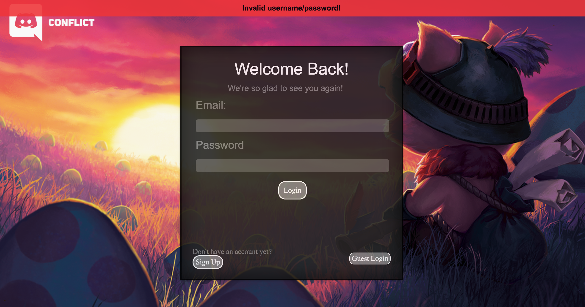
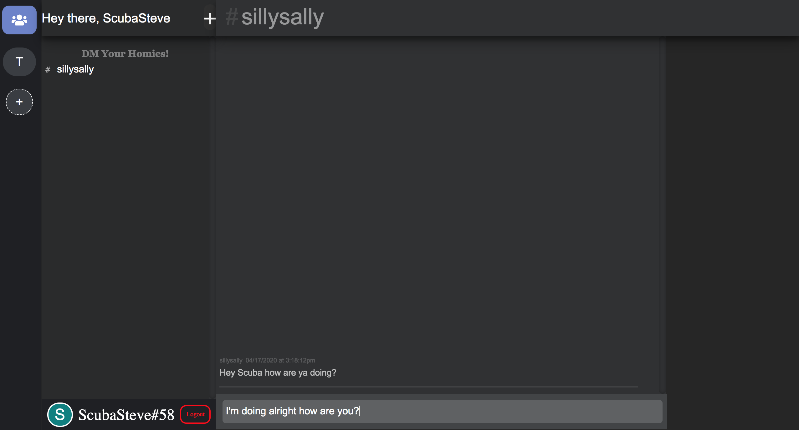
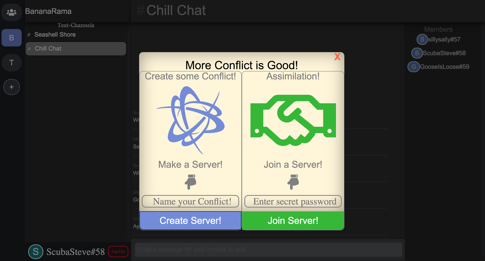

# README 

## Table of Contents
- [Live Site](#live-site)
- [Intro](#intro)
- [Features](#features)
- [Future Directions](#future-directions)

## Live Site
[http://conflictapp.herokuapp.com/](http://conflictapp.herokuapp.com/)

## Intro 
Welcome to Conflict, a full stack single page clone of [Discord](https://www.discordapp.com). Conflict supports live messaging in both group and private chats. Users who register with the site can create or join chat servers via invitation link.

### Technologies Used
1. React-Redux Supports front-end rendering of pages and for managing flux-pattern
2. Ruby on Rails Supports back-end server and accessing database 
3. PostgreSQL as the database system 
4. Heroku as the platform for hosting 

## Features
### User Authentication
Users will be able to login or sign up for an account with Conflict. Security of users are made a priority and so passwords are protected through encryption. Errors are rendered to inform users if they've put any false information in. 

A Demo user feature is also included!



A user's session is tracked via a session token. The backend server bootstraps the currently logged in user so they won't have to login again unless they sign out. This is accomplished via javascript to save the current user to the window.

```html
<% if logged_in? %>
  <script id="bootstrap-current-user" type="text/javascript">
  	window.currentUser = <%= render("api/users/user.json.jbuilder",
  		user: current_user).html_safe %>
  </script>
<% end %>
```

### Live/Direct Messaging
Users can chat with each other either in a group server or privately through DM's. 

Live chat is an essential feature to this app that is implemented via Ruby on Rails ActionCable websockets. Users are subscribed to a channel when they enter it. 
```javascript
    openSocket() {
        const cable = ActionCable.createConsumer();
        this.currentChat = cable.subscriptions.create({
        channel: 'ChatChannel'
        }, {
        connected: () => {
        },
        received: (messages) => {
            this.props.receiveMessages(messages);
        },
        create: function(chatContent) {
            this.perform('create', {
            content: chatContent
            });
        },
        load: function(){
            return this.perform("load")
        }
        });
    }
```
### Servers/Channels 
Users can create or join servers via an invitation link. 

The option of editing and deleting servers and channels are also available but ONLY to the server leader. 

## Future Directions
* Online status for the users 
* Edit and delete Messages
